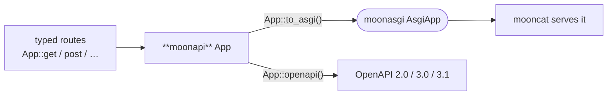

<div align="center">

# moonapi

**A typed web framework for MoonBit — `← FastAPI`.**

[](https://github.com/moonbitstack/moonapi/actions/workflows/ci.yml)
[](./LICENSE)
[](https://mooncakes.io/docs/moonbitstack/moonapi)

</div>

> Moved on mooncakes from `Lfan-ke/moonapi` to `moonbitstack/moonapi`.

`moonapi` builds an [`AsgiApp`](https://github.com/moonbitstack/moonasgi) from typed routes and generates its own **OpenAPI / Swagger** document — the role FastAPI plays for Python. It depends only on `moonasgi`, so it's backend-agnostic (routing and OpenAPI run in-process on every backend); a server such as [`mooncat`](https://github.com/moonbitstack/mooncat) runs the resulting app.



## Quickstart

```moonbit
let app = @moonapi.App::new()
app.get("/", _ctx => @moonapi.text(200, "Hello from moonapi!"))
app.get("/users/:id", ctx => @moonapi.text(200, "user " + ctx.param("id").unwrap()),
        summary="fetch a user")
app.post("/users", _ctx => @moonapi.text(201, "created"))

// One set of routes → every mainstream spec version:
let v31 = app.openapi_json(version=OpenApi31)   // OpenAPI 3.1.0
let v30 = app.openapi_json(version=OpenApi30)   // OpenAPI 3.0.3
let v20 = app.openapi_json(version=Swagger20)   // Swagger 2.0
let docs_page = @moonapi.swagger_ui()           // a Swagger UI page

// Serve it (native, via mooncat):
@mooncat.serve(app.to_asgi(), port=8000)
```

## What's here (`v0`)

- **Routing** — `App::get/post/put/patch/delete/route`, `:param` path segments extracted into `Context::param`, correct `404` (no path) vs `405` (path but not method). A route takes the operation arguments FastAPI's path operations take — `summary`, `description`, `tags`, `deprecated`, `operation_id`, `status_code`, `responses`, `name`, `include_in_schema`, and an `openapi_extra` fragment merged over the generated operation object — and `App::url_for(name, params)` resolves a named route back to its path (← `url_path_for`), mount prefix included.
- **Routers** — `Router` collects routes away from any application, and `App::include_router(router, prefix=, tags=, security=, dependencies=, responses=, deprecated=, include_in_schema=)` folds them in as the app's own (← FastAPI's `APIRouter` / `include_router`). The arguments given at the join reach every route in the group: tags, security requirements and dependencies lead the route's own, group responses are documented under it, and `deprecated` / `include_in_schema` mark or hide the whole set. A router is a value, so the same one can be included twice under different prefixes.
- **Descriptor tree** — a runtime `Schema` / `Param` / `Endpoint` tree (a one-first-class-value substitute for FastAPI's from-signature reflection) that a typed route carries. Walked **once** to (a) emit **complete** OpenAPI request/response body schemas — objects, arrays, scalars, `required`, nullable (`type: [t, "null"]` in 3.1, `nullable` in 3.0, `x-nullable` in 2.0), a `Map[String, T]` as `additionalProperties`, `Any` as the empty schema, a `format` such as `binary`, and defaults, with named models hoisted under `components/schemas` and referenced by `$ref` — and (b) drive request validation off the same tree. A `Param` carries the same constraints a `Field` does, plus a `default` and an `alias`, so a query parameter's bounds are both documented and enforced, and a `422` points at the name the client actually sent. User structs describe themselves with `derive(ToJson)` + a `T::schema()` associated function + a one-line `ToSchema` bridge (the mctl-friendly shape).
- **Multi-version OpenAPI** — `App::openapi` / `openapi_json` emit **Swagger 2.0, OpenAPI 3.0.3, and OpenAPI 3.1.0** from the same routes and descriptors (3.x `requestBody` + `components/schemas`; 2.0 body-parameter + `definitions`), because a good FastAPI is not pinned to one spec version.
- **Typed body extractors** — `Context::body[T]` deserialises the JSON body into a `derive(FromJson)` struct; `Context::body_validated[T]` first checks it against the endpoint descriptor and returns either the built value or a FastAPI-shaped `422` error list — schema emission, validation, and deserialisation all off one descriptor.
- **Dependency injection** — a `Container` (provider registry + `dependency_overrides`) with request-scoped, one-shot resolution (per-request caching) and `yield`-style teardown run LIFO around the handler — the explicit MoonBit equivalent of FastAPI's `Depends`. `App::depends(container.erase())` attaches one to the application, and any route builder takes `dependencies=["key"]` (← `dependencies=[Depends(...)]`): the keys resolve before the handler and are torn down after it, whatever the handler did. The teardown is handed the error that ended the request, so cleanup can tell a rollback from a commit.
- **OAuth2 + JWT security** — a `/token` password-grant endpoint issues an HS256 JWT (`create_access_token`), and an `OAuth2PasswordBearer` reads the `Authorization: Bearer` header, verifies the token, and enforces scopes: `401` on a missing or invalid/expired token, `403` when a valid token lacks a required scope. The token itself is `mooncred`'s and the algorithms are `mooncrypt`'s; moonapi names HS256 and hands over a key. `alg: "none"` cannot be expressed, the verifier's algorithm is the one that counts rather than the token's, and signatures compare in constant time — all of that is `mooncred`'s to guarantee, and it does.
- **Form & file extractors** — `Context::form` parses both an `application/x-www-form-urlencoded` body (percent- and `+`-decoded) and a `multipart/form-data` body, splitting the boundary stream into fields and byte-exact uploads (filename + content-type + `size` + the part's own headers + raw bytes). Reading the body is `moonhttp/mime`'s; a body is attacker-controlled and already buffered, so `@mime.Limits` bounds what one may spend — a thousand parts of a megabyte by default — and a body over either bound comes back as `None`, refused whole rather than truncated. `Context::oauth2_password_form` reads the OAuth2 password form off it.
- **response_model** — `filter_response` / `json_model` validate a handler's return value against a declared `Schema` and project it down to exactly the model's fields, so a route can hold a richer object internally than it exposes (an id, a password hash) and still emit only what it promised.
- **Middleware & exception handlers** — an outer middleware chain (`App::middleware`) with `cors(...)` (preflight + actual-request headers, configurable origins/methods/headers, credentials, exposed headers) and `gzip(...)` (`moonzip`'s compressor), plus exception handlers (`App::exception_handler`): a handler `raise`s an `HttpException` and the app maps it to a response, falling through to a built-in `{"detail": ...}` for `HttpException` and a `500` for anything else. `App::add_status_handler(code, ...)` swaps in a custom response for any error status — a routing `404` / `405` or a raised exception's status — so an app can serve its own error pages.
- **Per-operation security** — a route carries `security=[SecurityRequirement::new(scheme, scopes=[...])]`, and every scheme shape has a guard: `secure_oauth2`, `secure_oauth2_code`, `secure_bearer`, `secure_api_key` (header / query / cookie), `secure_basic`, `secure_digest`, `secure_openid`. Each surfaces the scheme in the spec *and* registers the check that runs **before** the handler — `401` with the `WWW-Authenticate` challenge the scheme owes (a scoped bearer route names the scope it wanted), `403` on a missing scope or a rejected API key. Every one takes `description=` and `auto_error=` (with the flag off, the guard admits an anonymous caller and leaves the decision to the route). A bare `add_security_scheme` documents without enforcing (FastAPI's split between a scheme and a wired dependency).
- **Background tasks** — a background-aware route (`App::route_bg`) receives a `BackgroundTasks` queue; `add_task` defers work that the app runs, in order, **after** the response is sent (← FastAPI's `BackgroundTasks`), so a slow write never delays the client.
- **Sub-application mounting** — `App::mount(prefix, subapp)` composes routers: a request under `prefix` is routed by the sub-app with the prefix stripped (its own middleware, security, and background tasks apply), and the sub-app's routes and security schemes fold into the parent's merged OpenAPI document under the prefix. Mounts nest. `App::mount_handler(prefix, handler)` mounts a foreign moonasgi `Handler` the same way — a third-party component, or static files — which the app routes to but does not document.
- **Streaming responses** — `App::stream(path, handler)` / `App::route_stream(verb, ...)` register a route returning a `moonasgi.StreamingResponse`, whose chunks reach the client as separate body events — a client reads the first long before the last one exists. `App::handle_with_stream` is the chunk-level view a test reads. A middleware is typed buffered-in, buffered-out, so one that rewrites the body (`gzip`) collapses the reply to a single chunk rather than cutting new bytes at boundaries that no longer describe them.
- **Server-Sent Events** — `moonhttp/sse` frames an event per the WHATWG event-stream format (`id` / `event` / `retry` / multi-line `data` / `:` comments); `sse_response` is a `text/event-stream` stream of those frames, **one chunk per event**, so each dispatches on arrival. Hand it to `App::stream`. (An event stream delivered as one body is not an event stream — it is a file shaped like one.)
- **WebSocket routes** — `App::websocket(path, handler)` over the moonasgi WS SEAM. The handler drives a `WebSocket` (accept / receive / send / close); it's a synchronous core, so `drive_websocket` runs it against an in-memory frame queue in a test and `App::to_asgi` serves it over the async transport.
- **Security schemes** — the six OpenAPI shapes (OAuth2 password and authorization-code flows, HTTP bearer / basic / digest, an API key in a header / query / cookie, and OpenID Connect) are emitted in each dialect's form: `components/securitySchemes` in 3.x, `securityDefinitions` in 2.0, where an `http` scheme becomes the standard `apiKey`-in-`Authorization` workaround and OpenID Connect — which 2.0 cannot express — is left out rather than described as something it is not.
- **Swagger UI** — `swagger_ui()` returns a ready-to-serve documentation page.
- **Responses** — `text`, `html`, `json` and `json_model` helpers over `moonasgi.Response`, plus `redirect(url, status=307)` (← `RedirectResponse`; the URL is encoded over the characters a URI reserves for structure, so an already-encoded URL passes through and a smuggled `CRLF` cannot open a header) and `file_response(content, filename=, media_type=, inline=)` (← `FileResponse`: a media type guessed from the extension, `Content-Length`, and a `Content-Disposition` that falls back to RFC 6266's `filename*` when the name will not survive quoting). It takes bytes rather than a path because moonapi has no filesystem — the same app runs on wasm, js and native.
- **Cookies** — `set_cookie(resp, name, value, max_age=, expires=, path=, domain=, secure=, http_only=, same_site=)` and `delete_cookie(...)` (← `response.set_cookie` / `delete_cookie`). Each returns a new response carrying one more `Set-Cookie`, which is the correct wire shape: two cookies are two headers, never one folded field. Names, values and attributes are stripped of the octets RFC 6265 forbids, so a value cannot forge an attribute or open a header of its own; `delete_cookie` expires by both `Max-Age=0` and a 1970 date. `Context::cookie` reads them back.
- **Status constants** — the 63 `HTTP_*` and 15 `WS_*` names FastAPI re-exports from Starlette (`HTTP_404_NOT_FOUND`, `WS_1008_POLICY_VIOLATION`), so a route table shows a deliberate `307` rather than a bare number.

Verified across all backends (`wasm`, `wasm-gc`, `js`, `native`) in CI, 0 warnings under `--deny-warn`.

## Configuration

Nothing here decides for you twice. Every bound is an argument with a published
default, and every default is the one the mainstream framework uses.

```moonbit
ctx.query("tag")                                       // the preset bound
ctx.query("tag", limits=@mime.Limits::new(parts=100000))
ctx.form(limits=@mime.Limits::new(part_size=8 << 20))  // an upload endpoint

create_access_token(sub, secret, now, extra={ "tenant": Json::string("acme") })
sse_response(events, headers=[("cache-control", "no-store")])
sse_response(events, space=false)
```

| Setting | Default | Why that one |
|:--:|:--:|:--|
| `query_limits.parts` | 1000 | `qs`, and therefore Express, allows a thousand query parameters |
| `query_limits.part_size` | 64 KiB | Well past the 8 KiB the common servers allow a whole request line |
| `form`'s `limits` | `@mime.limits` | Starlette's `max_files` and `max_fields`, with python-multipart's part size |
| `expires_in_secs` | 3600 | The hour every OAuth2 example issues |
| `space` on a stream | on | The space after a colon is universal on the wire and stripped by every reader |

### Where a setting can arrive twice

`create_access_token` computes `sub`, `iat`, `exp` and `scopes` from its
arguments, and `extra` adds claims alongside them. `sse_response` sets the three
headers a stream needs, and `headers` adds its own. Where the two name the same
thing, the rule is published rather than implied:

| Function | Who wins by default | What happens when both speak |
|:--:|:--:|:--|
| `create_access_token` | the arguments | aborts — a token whose subject is not the `subject` passed in is a mistake in the program |
| `sse_response` | the caller's header | replaces ours, so a response never carries two `content-type` headers |

Both take `wins` to turn the direction around and `clash` to choose between
merging in silence, aborting, and handing the decision to a callback of your
own. They are the same `wins` and `clash` `mooncred` uses, with the same
meanings.

## Design notes

Two places make an explicit, documented trade-off rather than a silent shortcut:

- **GZip** is `moonzip`'s, whose output zlib reads and whose reader takes what zlib writes. What lives here is the middleware around it: when to compress, and which headers to set.
- **WebSocket** handlers are a synchronous core: the same handler runs in a test and under a server. Because the core can't suspend on the async transport (MoonBit runs async only in an async context), the serving shell buffers the client's inbound frames, runs the handler, then emits its frames. Content and order are preserved — exact for echo, broadcast, and request-reply — but it doesn't interleave live per-frame with the client.

## Roadmap (transliterating FastAPI)

The descriptor tree (`Endpoint` / `Param` / `Schema`) drives OpenAPI body schemas and validation; on top sit the typed `derive(FromJson)` body extractors, the dependency-injection container, the OAuth2 password-bearer security layer, the `Form` / `File` extractors, and `response_model` filtering. On the middleware side: CORS, `gzip`, exception and per-status handlers, Server-Sent Events, and WebSocket routes.

**0.9.0 is where moonapi stopped being several libraries at once.** The cryptography went to `mooncrypt`, the token format to `mooncred`, the wire formats to `moonhttp`, the compression to `moonzip`, and the JSON to `moonjson` — 2 329 lines out of the framework and into libraries anything can use, with every existing test still passing. What is left is routing, extraction, validation, OpenAPI, injection and middleware, which is what a web framework is.

Next: splitting what remains into packages, so a program that wants the router does not link the OpenAPI writer; static files and templates; and codegen'd request schemas via `moonctl`.

## License

Apache-2.0.
